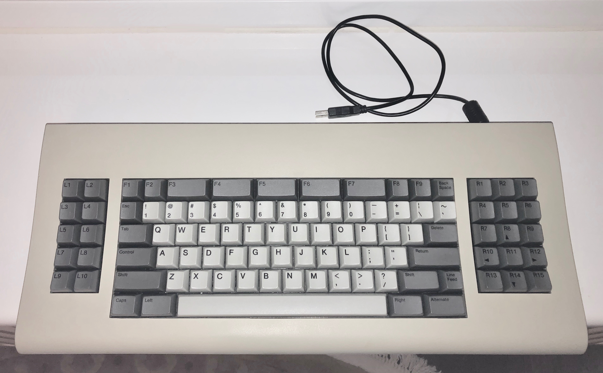
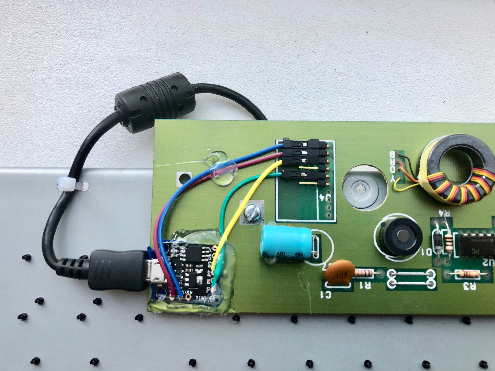

# sun3-kbd-digispark
USB interface for Sun Type 3 keyboard with Digispark and Arduino.

## Intro

When I received an old Sun Type 3 keyboard from a colleague (to whom many thanks!), I thought it would be a lot of fun to make it work with modern computers.
Originally it comes with a long coiled cable with the DB-15 plug and has a connector for the Sun mouse. Unfortunately, I do not have that mouse.

While looking on the Internet for a solution, I came across [this blog post](http://blog.daveastels.com.s3-website-us-west-2.amazonaws.com/2014/12/27/type-3-keyboard.html). While that project bases on different hardware, it provided enough information for me to be able to do it with a USB MCU board I already had.

## Inside the keyboard
Coiled cable with the DB-15 plug has been removed and replaced with a micro-USB to USB-A cable connected to a USB ATtiny85 board (Digispark clone with the micro-USB connector).

Inside the keyboard, the USB ATtiny85 board is connected by jumper wires with the keyboard interface. From top to bottom:
 * GND
 * +5 V
 * serial TX (from keyboard to MCU)
 * serial RX (from MCU to keyboard)
The two pins that are not connected are for the Sun mouse (not sure what pin is what).

The serial interface is asynchronous: 1200/8-N-1 with inverted polarity (level is low when the line is idle).

## Software
Communication protocols - USB and serial - and keycode conversion are implemented in software. Provided Arduino sketch should compile and run on a Digispark board. It requires the following libraries:
 * [SoftSerial-INT0](https://github.com/J-Rios/Digispark_SoftSerial-INT0): software implementation of the serial interface, using INT0 as RX interrupt
 * [Keyboard_6K](https://github.com/kostyaz/DigisparkKeyboard_6K): software implementation of the USB HID keyboard, with support for 6 simultaneous key presses (not including modifier keys).

## Reliability
This task barely fits the ATtiny85 MCU. The code consumes almost all of the available Flash and SRAM memory, and the speed is just enough (or even slightly NOT enough...) to keep up the USB link. It is possible to stall the USB communication by pressing/releasing too many keys quickly and simultaneously, thereby overloading the processor with interrupts and adding delays between USB polls. How big of a problem that is in practice depends on the USB host hardware. For example, it worked better on PCs than Macs in my tests. USB 1.1 interface is also more reliable than USB 2.0. USB 3.0 did not work at all, but that is also the case for Digispark in general - it's not meant for this.
Even with the above-mentioned limitations, the resulting implementation is robust enough to use the keyboard as the main computer keyboard when connected to a USB 1.1 or 2.0 port (that is if you get used to the key layout...).

I hope someone else will find it useful...

## Links
[SPARC Keyboard Specification](http://kentie.net/article/sunkbd/KBD.pdf)
[Sun special keys](http://kentie.net/article/sunkbd/sun%20keys.txt)
